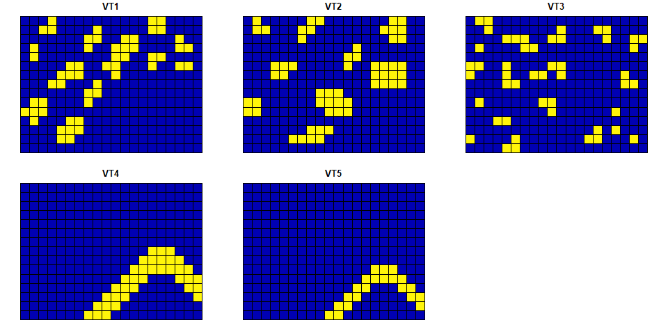

<!-- Readme document of LandComp R package -->

# LandComp

LandComp is a package for quantifying landscape diversity and structure
at multiple scales. Juhász-Nagy’s functions, i.e. compositional
diversity and associatum are used for these purposes.

## Installation

You can install the development version of LandComp using the following
command:

``` r
install.packages("devtools")
devtools::install_github("ladylavender/LandComp")
```

## Example

### Example for using regular square grid

Suggest we have data on some vegetation types along a landscape. Note,
there are three requirements:

- the landscape data should be numeric binary, i.e. it should contain 0
  or 1 values
- the geometry of the landscape data should be a regular square or
  hexagonal grid
- the geometry of the landscape data should have projected coordinates
  (i.e. WGS84 is useless)

``` r
suppressPackageStartupMessages(library("sf"))
library(LandComp)
data("square_data")
plot(square_data)
```

<!-- -->

``` r
str(square_data)
#> Classes 'sf' and 'data.frame':   300 obs. of  6 variables:
#>  $ VT1     : num  0 0 0 0 0 0 0 0 0 0 ...
#>  $ VT2     : num  0 0 0 0 0 0 0 0 0 0 ...
#>  $ VT3     : num  0 0 0 0 1 1 0 0 0 0 ...
#>  $ VT4     : num  0 0 0 0 0 0 0 1 1 1 ...
#>  $ VT5     : num  0 0 0 0 0 0 0 0 0 1 ...
#>  $ geometry:sfc_POLYGON of length 300; first list element: List of 1
#>   ..$ : num [1:5, 1:2] 400000 400000 405000 405000 400000 ...
#>   ..- attr(*, "class")= chr [1:3] "XY" "POLYGON" "sfg"
#>  - attr(*, "sf_column")= chr "geometry"
#>  - attr(*, "agr")= Factor w/ 3 levels "constant","aggregate",..: NA NA NA NA NA
#>   ..- attr(*, "names")= chr [1:5] "VT1" "VT2" "VT3" "VT4" ...
```

Two values of landscape diversity and structure can be calculated as
e.g.

``` r
LandComp(x = square_data, aggregation_steps = 0:1)
#>   AggregationStep SpatialUnit_Size SpatialUnit_Area SpatialUnit_Count
#> 1               0                1         2.50e+07               300
#> 2               1                9         2.25e+08               234
#>   UniqueCombination_Count   CD_bit    AS_bit
#> 1                      13 2.755349 0.1709469
#> 2                      18 3.176364 1.0874836
```

### Example for using regular hexagonal grid

``` r
data("hexagonal_data")
plot(hexagonal_data)
```

<!-- -->

``` r
str(hexagonal_data)
#> Classes 'sf' and 'data.frame':   300 obs. of  6 variables:
#>  $ VT1     : num  0 0 0 0 0 0 0 0 0 0 ...
#>  $ VT2     : num  0 0 0 0 0 0 0 0 0 0 ...
#>  $ VT3     : num  0 0 0 0 0 0 0 0 0 0 ...
#>  $ VT4     : num  1 1 0 1 1 1 0 1 1 1 ...
#>  $ VT5     : num  0 0 1 1 0 0 1 0 0 1 ...
#>  $ geometry:sfc_POLYGON of length 300; first list element: List of 1
#>   ..$ : num [1:7, 1:2] 649500 649000 649000 649500 650000 ...
#>   ..- attr(*, "class")= chr [1:3] "XY" "POLYGON" "sfg"
#>  - attr(*, "sf_column")= chr "geometry"
#>  - attr(*, "agr")= Factor w/ 3 levels "constant","aggregate",..: NA NA NA NA NA
#>   ..- attr(*, "names")= chr [1:5] "VT1" "VT2" "VT3" "VT4" ...
```

``` r
LandComp(x = hexagonal_data, aggregation_steps = 0:1)
#>   AggregationStep SpatialUnit_Size SpatialUnit_Area SpatialUnit_Count
#> 1               0                1         866025.4               300
#> 2               1                7        6062177.8               234
#>   UniqueCombination_Count   CD_bit    AS_bit
#> 1                      12 1.972863 0.1256525
#> 2                      16 3.422409 0.5394512
```
